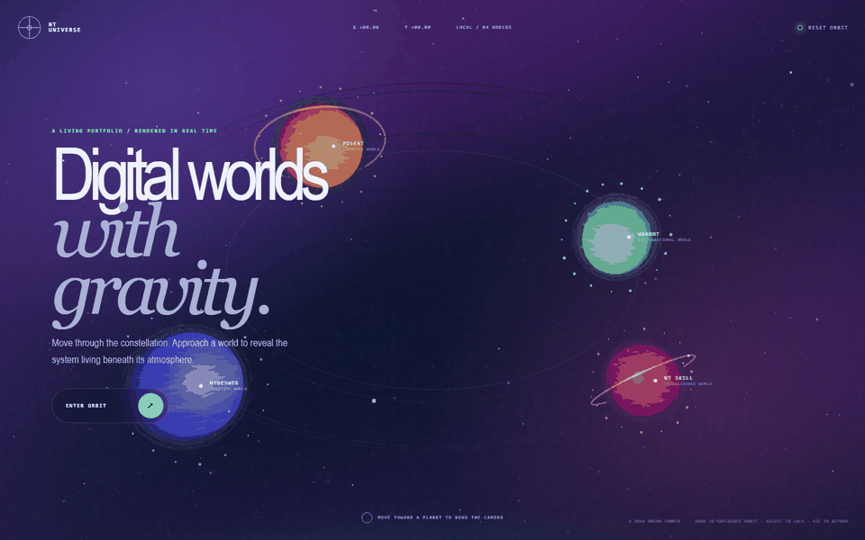
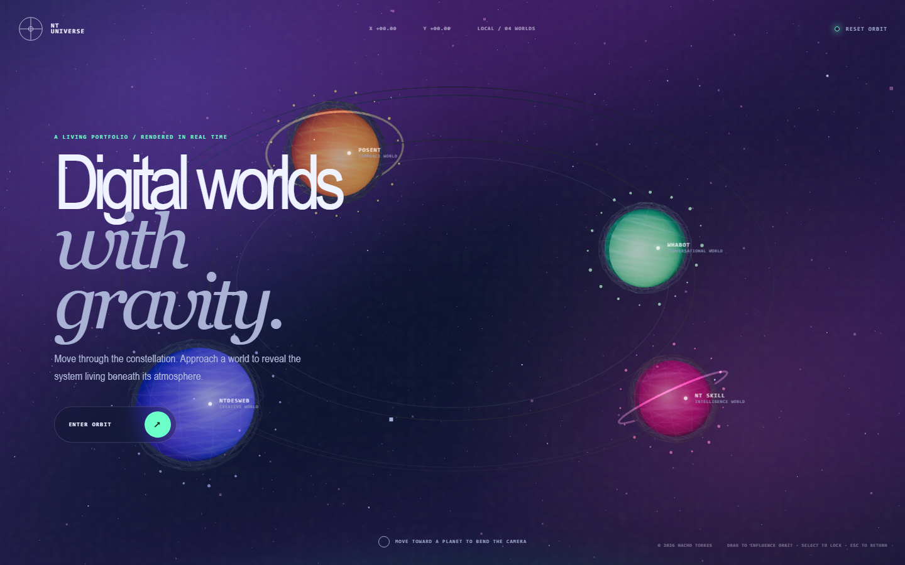
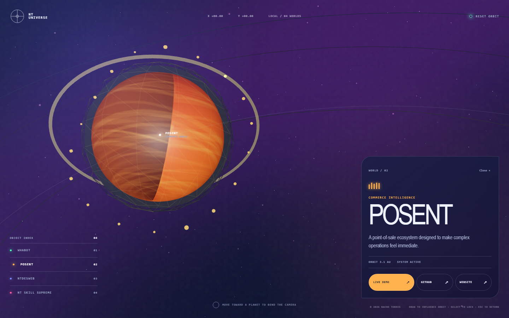

# Interactive Digital Universe

[](https://universe.ntdesweb.dev/)

- **Live experience:** https://universe.ntdesweb.dev/
- **Explore more NTDESWEB experiments:** https://fx.ntdesweb.dev/

A living WebGL constellation where WHABOT, POSENT, NTDESWEB and NT Skill Supreme exist as explorable digital worlds. Every planet has its own procedural surface, orbital behavior, particle system and verified project links.



## Experience design

- Four independent procedural planets with unique palettes and atmospheric systems.
- Continuous orbital motion, satellite particles, orbit paths and multi-depth star fields.
- Shader-generated nebula volume instead of a flat black star background.
- Raycast proximity makes the camera bend toward a planet and accelerates its rotation.
- Click/touch locks a world and reveals live demo, GitHub and website destinations.
- Drag, keyboard numbers, arrow keys and `Escape` provide alternate navigation.

## Captures

| Constellation | Planet focus |
| --- | --- |
|  |  |

## Technology

- Semantic HTML5
- Modern CSS and accessible responsive UI
- Vanilla JavaScript
- Three.js `0.160.0`
- GLSL shaders, Canvas textures, raycasting and WebGL particles

## Run locally

No build step is required.

```bash
python -m http.server 8080
```

Open `http://localhost:8080`.

## Deploy

This is a static project. For Cloudflare Pages:

1. Import `NachoTorresRD/interactive-digital-universe`.
2. Framework preset: `None`.
3. Build command: leave empty.
4. Output directory: `/`.
5. Attach the custom domain `universe.ntdesweb.dev`.

The included `_headers`, `robots.txt` and `sitemap.xml` are ready for the production domain.

## Accessibility and performance

- All worlds can be selected without a pointer.
- Clear focus styles, semantic controls and an accessible project index.
- `prefers-reduced-motion` stops non-essential orbital motion.
- Mobile rendering uses fewer particles, lower pixel density and touch-sized targets.
- The project index remains available if WebGL cannot initialize.

## License

[MIT](LICENSE) © 2026 Nacho Torres.
